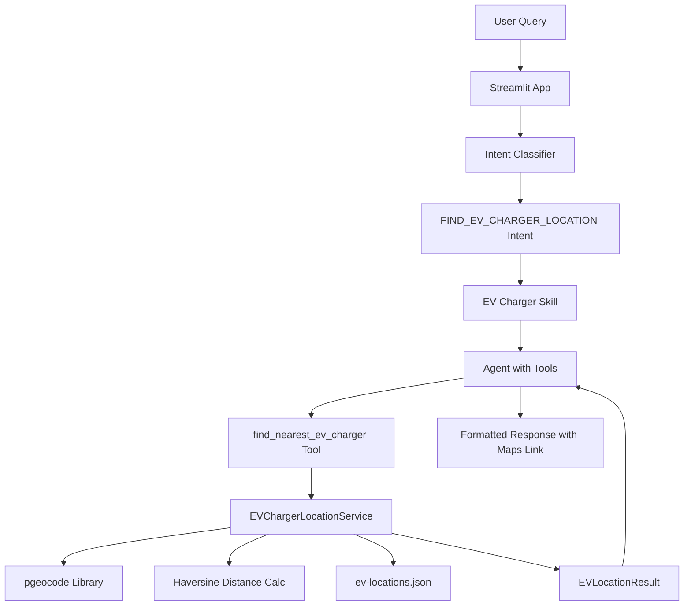

# EV Charger Location Service Implementation

## Overview

Add capability for users to find nearby EV charging stations by pincode with distance-based search and Google Maps integration.

## Architecture



## Implementation Steps

### 1. Create Data Models

**File:** [`src/mahindrabot/models/ev_location.py`](src/mahindrabot/models/ev_location.py)

- Create `EVLocationResult` Pydantic model with all fields from the data:
  - Basic info: `id`, `name`, `address`, `city`, `postal_code`, `country`
  - Location: `latitude`, `longitude`, `distance_km`, `coordinates`
  - Charging details: `capacity`, `charger_type`, `charging_type`, `no_of_chargers`, `available`
  - Operations: `timing`, `open`, `close`, `staff`
  - Payment: `cost_per_unit`, `payment_modes`
  - Other: `vendor`, `contact_number`, `google_maps_link`
- Export from [`src/mahindrabot/models/__init__.py`](src/mahindrabot/models/__init__.py)

### 2. Create EV Charger Service

**File:** [`src/mahindrabot/services/ev_charger_service.py`](src/mahindrabot/services/ev_charger_service.py)

```python
class EVChargerLocationService:
    def __init__(self, json_file: str):
        # Load data/ev-locations.json
        # Initialize pgeocode.Nominatim('in') (already installed)
    
    def find_nearest_ev_charger(
        self, 
        pincode: str, 
        radius_in_km: float = 25.0
    ) -> EVLocationResult | None:
        # Get coordinates from pincode using pgeocode
        # Calculate distances using haversine formula (from notebook)
        # Filter locations within radius
        # Return nearest location with distance_km and google_maps_link
```

- Use haversine formula from the notebook for distance calculation
- Generate Google Maps link: `https://www.google.com/maps/search/?api=1&query={lat},{lng}`
- Export from [`src/mahindrabot/services/__init__.py`](src/mahindrabot/services/__init__.py)
- Note: `pgeocode` is already installed

### 3. Add Serializer for EV Location Result

**File:** [`src/mahindrabot/services/serializers.py`](src/mahindrabot/services/serializers.py)

- Create `serialize_ev_location(ev_location: EVLocationResult) -> str` function
- Format similar to car serializers with clear sections:
  - Location header with name/id
  - Address and distance information
  - Charging specifications (capacity, type, available chargers)
  - Operating hours and staff info
  - Payment details
  - **Google Maps link prominently displayed**
- Follow the existing serializer patterns in the file
- Make output LLM-friendly and human-readable

### 4. Add Tool to AgentToolKit

**File:** [`src/mahindrabot/core/toolkit.py`](src/mahindrabot/core/toolkit.py)

- Add `ev_charger_service: EVChargerLocationService` to `__init__` parameters
- Create wrapper method that calls service and uses serializer:
  ```python
  def find_nearest_ev_charger(self, pincode: str, radius_in_km: float = 25.0) -> str:
      result = self.ev_charger_service.find_nearest_ev_charger(pincode, radius_in_km)
      if result:
          return serialize_ev_location(result)
      return "No EV charging stations found..."
  ```

- Register tool in `_register_tools()`
- Description: "Find the nearest EV charging station by pincode within a specified radius. Returns location details including Google Maps link."

### 5. Add New Intent Type

**File:** [`src/mahindrabot/core/models.py`](src/mahindrabot/core/models.py)

- Add `FIND_EV_CHARGER_LOCATION = "find_ev_charger_location"` to `IntentType` enum

### 6. Create EV Charger Skill

**File:** [`src/mahindrabot/core/skills.py`](src/mahindrabot/core/skills.py)

- Add skill for `IntentType.FIND_EV_CHARGER_LOCATION` to `SKILLS` dict
- Instructions should emphasize:
  - Using the tool to find nearest charger
  - Presenting location details clearly
  - **ALWAYS including Google Maps link** in format: [`View on Google Maps`](https://www.google.com/maps/search/?api=1&query=LAT,LNG)
  - Suggesting alternative radius if no results found
- Relevant tools: `["find_nearest_ev_charger"]`

### 7. Update Intent Classification

**File:** [`src/mahindrabot/core/intents.py`](src/mahindrabot/core/intents.py)

- Add to `INTENT_CLASSIFICATION_PROMPT`:
```
6. find_ev_charger_location - Finding nearby EV charging stations
   Examples: "Where can I charge my EV?", "EV charging station near 110092", 
             "Find EV charger near me", "Charging station in Delhi"
```


### 8. Update Agent Instructions

**File:** [`src/mahindrabot/core/agent.py`](src/mahindrabot/core/agent.py)

- Update `BASE_SYSTEM_PROMPT` to include EV charger location in capabilities:
  - "Car recommendations and comparisons"
  - "Insurance information and FAQs"
  - "Test drive bookings"
  - **"EV charging station locations"** ← ADD THIS

### 8. Update Streamlit App

**File:** [`streamlit_apps/mahindra_bot_app.py`](streamlit_apps/mahindra_bot_app.py)

- Initialize `EVChargerLocationService` in `initialize_services()`:
  - Load from `Path("data/ev-locations.json")`
  - Pass to `AgentToolKit` constructor
- Add to sidebar intent list in `render_sidebar()`:
  - `"🔌 EV Charger Location"` with description "Find nearby charging stations"
- Add emoji mapping: `"find_ev_charger_location": "🔌"`
- Update example queries to include: "Find EV charging station near 110092"

### 9. Install Dependencies

**File:** [`requirements.txt`](requirements.txt) (or equivalent)

- Add `pgeocode` library for pincode to coordinates conversion

### 10. Update Service Initialization

**File:** [`src/mahindrabot/core/toolkit.py`](src/mahindrabot/core/toolkit.py)

- Update `AgentToolKit.__init__()` signature to accept `ev_charger_service`
- Update all places where `AgentToolKit` is instantiated to pass the new service

## Key Technical Details

- **Distance Calculation:** Use haversine formula from notebook (Earth radius 6371.0 km)
- **Google Maps Link Format:** `https://www.google.com/maps/search/?api=1&query={latitude},{longitude}`
- **Default Radius:** 25 km (user can override)
- **Pincode Validation:** Handle invalid pincodes gracefully via pgeocode (returns NaN)
- **No Results:** Skill should suggest trying larger radius or different pincode
- **Serializer:** Use `serialize_ev_location()` to format results consistently with other services
- **Dependencies:** `pgeocode` is already installed in the environment

## Testing Suggestions

Test with sample queries:

- "Find EV charging station near 110092"
- "Where can I charge my electric vehicle in Delhi?"
- "EV charger within 10 km of 400001"
- "Nearest charging station for my EV"