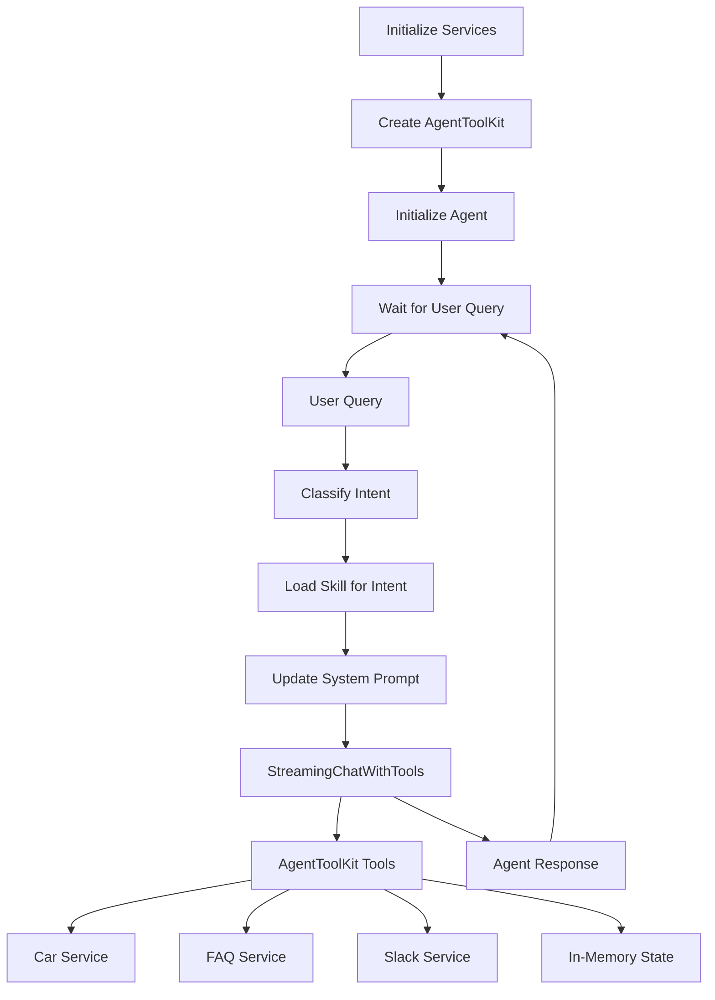

# Mahindra Bot Core Implementation Plan

## Overview

This plan implements a sophisticated agent system for the Mahindra Bot that classifies user intents, loads appropriate skills with specialized instructions, and executes relevant tools to help users with insurance queries, car recommendations, comparisons, and test drive bookings.

## Architecture



## Implementation Structure

### 1. File Organization

All new code will be in [`src/mahindrabot/core/`](src/mahindrabot/core/):

- [`src/mahindrabot/core/__init__.py`](src/mahindrabot/core/__init__.py) - Public API exports
- [`src/mahindrabot/core/models.py`](src/mahindrabot/core/models.py) - Pydantic models (Skill, Intent, IntentType enum)
- [`src/mahindrabot/core/toolkit.py`](src/mahindrabot/core/toolkit.py) - AgentToolKit implementation
- [`src/mahindrabot/core/skills.py`](src/mahindrabot/core/skills.py) - Skill definitions
- [`src/mahindrabot/core/intents.py`](src/mahindrabot/core/intents.py) - Intent classification
- [`src/mahindrabot/core/agent.py`](src/mahindrabot/core/agent.py) - Core agent flow
- [`src/mahindrabot/core/state.py`](src/mahindrabot/core/state.py) - State management

### 2. Data Models (`models.py`)

Create Pydantic models for core abstractions:

```python
from enum import Enum
from pydantic import BaseModel

class IntentType(str, Enum):
    """Enum for supported intent types"""
    GENERAL_QNA = "general_qna"
    CAR_RECOMMENDATION = "car_recommendation"
    CAR_COMPARISON = "car_comparison"
    BOOK_RIDE = "book_ride"

class Intent(BaseModel):
    """Classified user intent"""
    intent_name: IntentType  # Enum value, not plain string
    confidence: float  # 0.0 to 1.0
    reasoning: str  # Why this intent was chosen
    
class Skill(BaseModel):
    """Skill definition with instructions and tools"""
    name: str
    instruction: str  # Detailed instructions for this skill
    relevant_tools: list[str]  # Tool names this skill can use
```

### 3. AgentToolKit (`toolkit.py`)

Implement the main toolkit that wraps all services and provides tools:

**Constructor:**

- Accept `car_service: CarService`, `faq_service: FAQService` as parameters
- Initialize internal state manager
- Register all tools using `ToolKit.register()` method (NO @tool decorator)

**Tools to implement:**

1. **list_cars** - Wraps `car_service.list_cars()`

      - Parameters: limit, offset, all optional filters (min_price, max_price, brand, body_type, fuel_type, mileage_more_than, mileage_less_than, seating_capacity, transmission, engine_displacement_more_than, engine_displacement_less_than)
      - Returns: JSON string of list[CarDetail]
      - Error handling: Catch `InvalidFilterError`, provide helpful messages

2. **search_car** - Wraps `car_service.search()`

      - Parameters: query, limit, optional filters (same as list_cars)
      - Returns: JSON string of list[CarDetail]
      - Error handling: Handle empty results gracefully

3. **get_car_comparison** - Wraps `car_service.get_car_comparison()`

      - Parameters: car_ids (list[str])
      - Returns: JSON string of CarComparison with comparison matrix
      - Error handling: Catch `CarNotFoundError`, suggest alternatives

4. **search_faq** - Wraps `faq_service.search()`

      - Parameters: query (str), limit (int, default 5, max 15)
      - Returns: JSON string of list[QNAResult] with questions, answers, scores
      - **Special handling**: If no relevant FAQs found (empty results or low scores), return message: "I couldn't find any relevant information in our FAQ database. Please contact customer support for assistance."
      - Enforce hard limit of 15 results
      - **ONLY used in general_qna skill**

5. **book_ride** - Initiates test drive booking

      - Parameters: name (str), phone_number (str)
      - Generates 6-digit OTP, stores in state with timestamp
      - Sends Slack message with OTP using [`slack.send_message()`](src/mahindrabot/services/slack.py)
      - Returns: Confirmation message (without revealing OTP to LLM)

6. **confirm_ride** - Confirms test drive booking

      - Parameters: otp (str)
      - Validates OTP against state
      - Returns: Success/failure message
      - Clears OTP from state on success

**Tool registration approach:**

```python
from src.mahindrabot.services.llm_service import ToolKit

class AgentToolKit:
    def __init__(self, car_service, faq_service):
        self.car_service = car_service
        self.faq_service = faq_service
        self.state_manager = StateManager()
        self.toolkit = ToolKit()
        self._register_tools()
    
    def _register_tools(self):
        # Register each tool using toolkit.register()
        self.toolkit.register(
            func=self.list_cars,
            name="list_cars",
            description="List cars with optional filters and pagination"
        )
        # ... register other tools
    
    def get_tools(self):
        return self.toolkit.get_tools()
    
    def list_cars(self, limit: int, offset: int = 0, ...):
        # Implementation returns JSON string
        pass
```

- Use `ToolKit.register()` method (NOT @tool decorator)
- Each tool function should return JSON string or simple string
- Handle exceptions gracefully, return user-friendly error messages

### 4. Skills System (`skills.py`)

Define 4 skills as Skill objects using the IntentType enum:

**1. general_qna (IntentType.GENERAL_QNA)**

- Instruction: 
  ```
  You are helping users with general questions about insurance, documentation, 
  processes, and policies. Use the search_faq tool to find relevant information.
  
  If search_faq returns no relevant results or the message "I couldn't find any 
  relevant information", inform the user that we don't have that information 
  available and suggest they contact customer support.
  
  Always acknowledge the user's question with a friendly preamble before 
  searching for information.
  ```

- Tools: `["search_faq"]`

**2. car_recommendation (IntentType.CAR_RECOMMENDATION)**

- Instruction: 
  ```
  You are helping users find the right car based on their preferences, budget, 
  and requirements. Use list_cars for browsing with filters, or search_car when 
  users mention specific car names or features.
  
  Ask clarifying questions about:
 - Budget (min_price, max_price)
 - Body type preference (SUV, Sedan, Hatchback, etc.)
 - Fuel type preference
 - Seating capacity needs
 - Transmission preference (Manual/Automatic)
  
  Provide 3-5 top recommendations with key highlights. Guide users through 
  filters effectively.
  ```

- Tools: `["list_cars", "search_car"]`

**3. car_comparison (IntentType.CAR_COMPARISON)**

- Instruction: 
  ```
  You are helping users compare multiple cars to make an informed decision.
  
  First, identify the cars to compare using search_car or list_cars if needed.
  Then use get_car_comparison with the car IDs to generate a detailed comparison.
  
  Highlight key differences in:
 - Price
 - Engine and performance
 - Fuel efficiency
 - Features and specifications
 - Value proposition
  
  Help users understand which car best fits their needs.
  ```

- Tools: `["get_car_comparison", "search_car", "list_cars"]`

**4. book_ride (IntentType.BOOK_RIDE)**

- Instruction: 
  ```
  You are helping users book a test drive for their chosen car.
  
  Flow:
 1. Confirm which car they want to test drive (use search_car/list_cars if needed)
 2. Collect their name and phone number
 3. Use book_ride to initiate the booking (OTP will be sent to their phone/notification)
 4. Ask them to provide the OTP they received
 5. Use confirm_ride to verify the OTP and complete the booking
  
  Be friendly and guide them through each step. Handle errors gracefully.
  ```

- Tools: `["book_ride", "confirm_ride", "search_car", "list_cars"]`

**Skills dictionary:**

```python
SKILLS: dict[IntentType, Skill] = {
    IntentType.GENERAL_QNA: Skill(
        name="general_qna",
        instruction="...",
        relevant_tools=["search_faq"]
    ),
    # ... other skills
}
```

Each skill's instruction should include:

- When to use each tool
- How to handle tool errors gracefully
- Guidelines for asking clarifying questions
- Reminder to provide preamble before calling tools
- Instruction to never leak tool details to user

### 5. Intent Classification (`intents.py`)

**Function:** `classify_intent(messages: list[MessageType], llm_config: LLMConfig) -> Intent`

Implementation:

- **Focus on the LAST user message only** for classification
- Uses `get_llm_structured_response()` from [`llm_service.core`](src/mahindrabot/services/llm_service/core.py)
- Returns structured `Intent` object with IntentType enum, confidence, reasoning

Classification prompt (updated to focus on last message):

```python
INTENT_CLASSIFICATION_PROMPT = """
You are an intent classifier for Mahindra Bot, an assistant for car buying and insurance.

Analyze the user's LAST message and classify their intent:

1. general_qna - Questions about insurance, processes, documentation, general information
   Examples: "What documents are needed?", "How does insurance work?", "What is RC transfer?"

2. car_recommendation - Finding the right car based on preferences and budget
   Examples: "I want a car under 15 lakhs", "Show me SUVs", "What cars have good mileage?"

3. car_comparison - Comparing specific cars or asking about differences
   Examples: "Compare Thar and Scorpio", "Which is better?", "Difference between X and Y"

4. book_ride - Booking a test drive or trial ride
   Examples: "I want to test drive", "Book a ride", "Schedule a test drive"

Focus ONLY on the user's most recent message. Consider:
- Explicit keywords (e.g., "compare" → car_comparison, "test drive" → book_ride)
- Question type (e.g., "what documents" → general_qna)
- Stated requirements (e.g., "under 15 lakhs" → car_recommendation)

Provide your classification with confidence (0.0-1.0) and brief reasoning.
"""
```

**Implementation example:**

```python
def classify_intent(messages: list[MessageType], llm_config: LLMConfig) -> Intent:
    # Extract only the last user message
    user_messages = [m for m in messages if isinstance(m, UserMessage)]
    if not user_messages:
        return Intent(
            intent_name=IntentType.GENERAL_QNA,
            confidence=0.5,
            reasoning="No user message found, defaulting to general_qna"
        )
    
    last_user_message = user_messages[-1]
    
    classification_messages = [
        SystemMessage(content=INTENT_CLASSIFICATION_PROMPT),
        UserMessage(content=f"User's last message: {last_user_message.content}")
    ]
    
    return get_llm_structured_response(llm_config, classification_messages, Intent)
```

### 6. State Management (`state.py`)

Simple in-memory state for OTP management:

```python
from datetime import datetime, timedelta
from typing import Optional

class StateManager:
    """In-memory state management for OTP and booking flow"""
    
    def __init__(self):
        self._state: dict[str, dict] = {}
    
    def store_otp(self, phone: str, otp: str, name: str) -> None:
        """Store OTP with user info and timestamp"""
        self._state[phone] = {
            "otp": otp,
            "name": name,
            "timestamp": datetime.now(),
        }
    
    def verify_otp(self, phone: str, otp: str) -> tuple[bool, Optional[str]]:
        """
        Verify OTP and return (success, name).
        Clears OTP on successful verification.
        """
        if phone not in self._state:
            return False, None
        
        stored = self._state[phone]
        
        # Check expiry (10 minutes)
        if datetime.now() - stored["timestamp"] > timedelta(minutes=10):
            del self._state[phone]
            return False, None
        
        # Verify OTP
        if stored["otp"] == otp:
            name = stored["name"]
            del self._state[phone]
            return True, name
        
        return False, None
    
    def cleanup_expired(self, expiry_minutes: int = 10) -> None:
        """Remove expired OTPs"""
        now = datetime.now()
        expired = [
            phone for phone, data in self._state.items()
            if now - data["timestamp"] > timedelta(minutes=expiry_minutes)
        ]
        for phone in expired:
            del self._state[phone]
```

### 7. Core Agent Flow (`agent.py`)

**Main function:** `run_mahindra_bot(user_input: str, messages: list[MessageType], toolkit: AgentToolKit, llm_config: LLMConfig) -> Generator[AgentResponse, None, AgentResponse]`

Flow (updated to match architecture diagram):

1. **Agent is already initialized at the start of the system**
2. User provides input
3. Append user message to conversation history
4. Classify intent using **only the last user message**
5. Load appropriate skill based on intent
6. Build/update system prompt:

      - Base instructions (Mahindra Bot introduction, behavior guidelines)
      - Skill-specific instructions
      - Tool usage reminders

7. Filter tools to only those relevant for this skill
8. Initialize agent with updated context and relevant tools
9. Stream `AgentResponse` back to caller

**System Prompt Template:**

```
You are Mahindra Bot, an AI assistant specializing in helping customers with:
- Car recommendations and comparisons
- Insurance information and FAQs  
- Test drive bookings

Core Guidelines:
- Always provide a friendly preamble acknowledging the user's request BEFORE using any tool
- Provide clear, concise, and helpful answers
- Ask clarifying questions when the user's request is vague or incomplete
- NEVER reveal tool names, function calls, errors, or technical details to users
- If a tool fails or returns no results, provide a graceful fallback or helpful alternative
- Do not leak tool details - users should not know you're using tools

{skill_instructions}

Remember: The user cannot see tool calls or results. Present information naturally.
```

**State Management:**

- Maintain `messages: list[MessageType]` across turns
- Track current skill/intent
- Pass `toolkit` instance throughout

**Error Handling:**

- Catch tool errors, reclassify intent if needed
- Log errors for debugging
- Provide graceful fallbacks

### 8. Public API (`__init__.py`)

Export clean interface:

```python
from .agent import run_mahindra_bot
from .toolkit import AgentToolKit
from .models import Skill, Intent, IntentType
from .skills import SKILLS

__all__ = [
    "run_mahindra_bot",
    "AgentToolKit",
    "Skill",
    "Intent",
    "IntentType",
    "SKILLS",
]
```

## Integration Points

1. **Car Service**: Use existing [`CarService`](src/mahindrabot/services/car_service.py) with its error handling
2. **FAQ Service**: Use existing [`FAQService`](src/mahindrabot/services/faq_service.py) for semantic search
3. **LLM Service**: Use [`StreamingChatWithTools`](src/mahindrabot/services/llm_service/agent.py), [`get_llm_structured_response`](src/mahindrabot/services/llm_service/core.py)
4. **Slack Service**: Use [`send_message()`](src/mahindrabot/services/slack.py) for OTP notifications
5. **Models**: Use [`CarDetail`](src/mahindrabot/models/car.py), [`QNAResult`](src/mahindrabot/services/serializers.py)

## Key Design Decisions

1. **Functional Architecture**: Core flow is functional with state passed explicitly
2. **Service Injection**: Services created outside and injected into toolkit
3. **Skill-Based Routing**: Intent classification determines which skill/tools to use
4. **IntentType Enum**: Strongly typed intent names using string enum
5. **No @tool Decorator**: Use ToolKit.register() method for all tools
6. **Last Message Only**: Intent classification focuses on most recent user message
7. **FAQ Handling**: search_faq only in general_qna, with explicit no-results handling
8. **Dynamic System Prompts**: System prompt updates based on classified intent
9. **Streaming Support**: Use generators throughout for real-time responses
10. **Error Isolation**: Tools handle their own errors, never leak to user

## Testing Strategy

Create comprehensive tests:

- Unit tests for each toolkit tool
- Intent classification accuracy tests
- End-to-end conversation flows
- Error handling scenarios
- State management (OTP flow)

## Example Usage

```python
from src.mahindrabot.core import run_mahindra_bot, AgentToolKit
from src.mahindrabot.services import CarService, FAQService
from src.mahindrabot.services.llm_service import LLMConfig

# Initialize services
car_service = CarService("data/cars")
faq_service = FAQService("data/consolidated_faqs.json")

# Create toolkit
toolkit = AgentToolKit(
    car_service=car_service,
    faq_service=faq_service
)

# Initialize configuration and message history
llm_config = LLMConfig(model_id="gpt-4o-mini")
messages = []

# Conversation loop
while True:
    user_input = input("You: ")
    if user_input.lower() in ["exit", "quit"]:
        break
    
    # Run bot (agent initialized inside run_mahindra_bot)
    for response in run_mahindra_bot(
        user_input=user_input,
        messages=messages,
        toolkit=toolkit,
        llm_config=llm_config
    ):
        # Stream response updates
        if response.final_message:
            print(f"Bot: {response.final_message.content}")
```

## Files to Create

1. [`src/mahindrabot/core/__init__.py`](src/mahindrabot/core/__init__.py)
2. [`src/mahindrabot/core/models.py`](src/mahindrabot/core/models.py)
3. [`src/mahindrabot/core/state.py`](src/mahindrabot/core/state.py)
4. [`src/mahindrabot/core/toolkit.py`](src/mahindrabot/core/toolkit.py)
5. [`src/mahindrabot/core/skills.py`](src/mahindrabot/core/skills.py)
6. [`src/mahindrabot/core/intents.py`](src/mahindrabot/core/intents.py)
7. [`src/mahindrabot/core/agent.py`](src/mahindrabot/core/agent.py)

## Next Steps

After implementation:

1. Create demo script showcasing all 4 intent flows
2. Add logging for intent classification and tool calls
3. Create configuration file for tunable parameters (intent window, OTP expiry, etc.)
4. Build conversation state persistence (optional)
5. Add metrics/analytics for intent accuracy