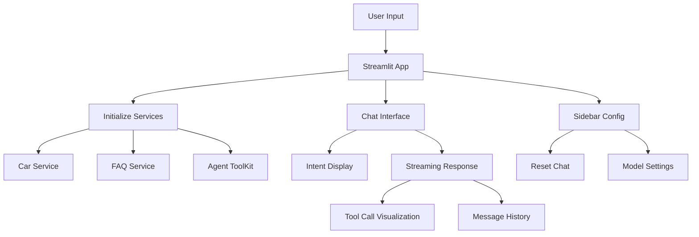

# Mahindra Bot Streamlit App

## Overview

Create a production-ready Streamlit application for the Mahindra Bot that enables users to interact with the bot through a rich web interface. The app will support all 4 intent types (general Q&A, car recommendation, car comparison, and test drive booking) with real-time streaming, intent classification visualization, and tool execution tracking.

## Architecture



## Key Components

### 1. Main Application Structure (`streamlit_apps/mahindra_bot_app.py`)

The main application file will follow the structure from [`experiment-notebooks/reference_streamlit.py`](experiment-notebooks/reference_streamlit.py) but adapted for Mahindra Bot:

- **Session State Management**: Store agent toolkit, messages list, and agent state
- **Sidebar Configuration**: Reset chat button and configuration display
- **Chat Interface**: Main chat area with streaming responses
- **Message Rendering**: Custom rendering for user/AI messages with tool visualizations

### 2. Session State Initialization

Initialize the following in session state on first load:

```python
if "messages" not in st.session_state:
    st.session_state.messages = []  # MessageType list for run_mahindra_bot
if "agent_toolkit" not in st.session_state:
    st.session_state.agent_toolkit = AgentToolKit(car_service, faq_service)
if "llm_config" not in st.session_state:
    st.session_state.llm_config = LLMConfig(model_id="gpt-4o-mini")
if "conversation_display" not in st.session_state:
    st.session_state.conversation_display = []  # For UI display only
```

### 3. Service Initialization

Based on [`demos/demo_mahindra_bot.py`](demos/demo_mahindra_bot.py):

- Load `.env` file using `dotenv.load_dotenv()`
- Initialize `CarService` from `data/new_car_details/`
- Initialize `FAQService` from `data/consolidated_faqs.json`
- Create `AgentToolKit` with both services
- Configure `LLMConfig` with default model settings

**Error Handling:**

- Check for `OPENAI_API_KEY` in environment
- Verify data paths exist (`data/new_car_details/`, `data/consolidated_faqs.json`)
- Display clear error messages with setup instructions if missing

### 4. Chat Message Rendering

Create rich message rendering functions:

#### User Messages

Simple markdown display with user icon

#### AI Messages with Tool Calls (`render_ai_response`)

Based on reference structure but enhanced:

```python
def render_ai_response(response: AgentResponse):
    """Render AI response with intent, tool calls, and final message."""
    
    # Display detected intent (if available from agent metadata)
    # Show intent badge with confidence level
    
    # Render each step with tool calls
    for step in response.steps:
        if step.ai_message.content:
            st.markdown(step.ai_message.content)
        
        # Show tool executions
        for tool_result in step.tool_results:
            status_icon = "✅" if tool_result.status == 1 else "❌"
            with st.expander(
                f"{status_icon} Tool: {tool_result.name}",
                expanded=False
            ):
                if tool_result.input:
                    st.markdown("**Input:**")
                    st.json(tool_result.input)
                if tool_result.output:
                    st.markdown("**Output:**")
                    st.text(tool_result.output)
    
    # Display final message
    if response.final_message:
        if response.final_message.content:
            st.markdown(response.final_message.content)
```

### 5. Intent Visualization

Add an intent display section that shows:

- Detected intent type (from agent logs/prints)
- Confidence level with progress bar
- Reasoning text
- Active skill and relevant tools

**Implementation Note:** Since [`src/mahindrabot/core/agent.py`](src/mahindrabot/core/agent.py) prints intent classification info, we'll need to capture this or modify the function to return intent metadata.

### 6. Streaming Implementation

Follow the streaming pattern from [`experiment-notebooks/reference_streamlit.py`](experiment-notebooks/reference_streamlit.py):

```python
if user_input := st.chat_input("Ask me anything about cars, insurance, or bookings..."):
    # Display user message
    with st.chat_message("user"):
        st.markdown(user_input)
    
    # Add to display history
    st.session_state.conversation_display.append({
        "role": "user",
        "content": user_input
    })
    
    # Stream AI response
    with st.spinner("Thinking..."), st.chat_message("assistant"):
        response_container = st.empty()
        
        for response in run_mahindra_bot(
            user_input,
            st.session_state.messages,
            st.session_state.agent_toolkit,
            st.session_state.llm_config
        ):
            with response_container.container():
                render_ai_response(response)
        
        # Store final response in display history
        st.session_state.conversation_display.append({
            "role": "assistant",
            "response": response
        })
```

### 7. Sidebar Features

```python
with st.sidebar:
    st.title("🚗 Mahindra Bot")
    
    # Reset chat button
    if st.button("🔄 Reset Chat"):
        st.session_state.messages = []
        st.session_state.conversation_display = []
        st.rerun()
    
    # Display current configuration
    st.markdown("---")
    st.subheader("Configuration")
    st.text(f"Model: {st.session_state.llm_config.model_id}")
    
    # Display available intents
    st.markdown("---")
    st.subheader("Available Intents")
    st.markdown("""
    - 🤔 General Q&A
    - 🚗 Car Recommendation
    - ⚖️ Car Comparison
    - 📅 Book Test Drive
    """)
    
    # Display service status
    st.markdown("---")
    st.subheader("Service Status")
    st.success("✅ Car Service Ready")
    st.success("✅ FAQ Service Ready")
```

### 8. Conversation History Rendering

```python
def render_conversation_history():
    """Render all previous messages in the conversation."""
    for msg in st.session_state.conversation_display:
        if msg["role"] == "user":
            with st.chat_message("user"):
                st.markdown(msg["content"])
        else:
            with st.chat_message("assistant"):
                render_ai_response(msg["response"])
```

## File Structure

```
streamlit_apps/
├── mahindra_bot_app.py          # Main Streamlit application
├── README.md                     # Usage instructions
└── .streamlit/                   # Streamlit config (optional)
    └── config.toml               # Theme and settings
```

## Implementation Details

### Data Flow

1. **User Input** → Chat input captured
2. **Intent Classification** → Logged/captured from agent flow
3. **Tool Execution** → Streamed via `run_mahindra_bot`
4. **Response Rendering** → Progressive updates during streaming
5. **History Update** → Stored in session state

### Error Handling

- Wrap service initialization in try-except blocks
- Display friendly error messages for missing API keys or data files
- Handle network errors gracefully during LLM calls
- Provide fallback UI states when errors occur

### Performance Considerations

- Services initialized once and cached in session state
- Messages list maintained efficiently (only references)
- Streaming prevents UI blocking
- Tool results displayed progressively

## Testing Strategy

After implementation, test these scenarios:

1. **General Q&A**: Ask insurance/documentation questions
2. **Car Recommendation**: Request cars by budget/features
3. **Car Comparison**: Compare 2-3 cars
4. **Test Drive Booking**: Simulate booking flow
5. **Multi-turn Conversations**: Test context retention
6. **Reset Functionality**: Verify clean state reset
7. **Error Scenarios**: Test without API key, missing data files

## Usage Instructions (for README.md)

```bash
# From project root
streamlit run streamlit_apps/mahindra_bot_app.py

# Access at http://localhost:8501
```

## Dependencies

All required dependencies are already in [`pyproject.toml`](pyproject.toml):

- `streamlit>=1.52.1` ✅
- `openai>=2.11.0` ✅
- `python-dotenv>=1.2.1` ✅
- All mahindrabot services available ✅

## Key Design Decisions

1. **Session State Structure**: Separate `messages` (for agent logic) from `conversation_display` (for UI rendering) to keep concerns separated
2. **Streaming Pattern**: Use generator pattern from `run_mahindra_bot` for real-time updates
3. **Tool Visualization**: Expandable sections keep UI clean while providing detail on demand
4. **Error Recovery**: Graceful degradation with helpful error messages guides users to fix issues
5. **Intent Display**: Show classification results to help users understand bot behavior

## Future Enhancements (Out of Scope)

- Model selection dropdown in sidebar
- Temperature/parameter controls
- Export conversation history
- Save/load chat sessions
- Multi-language support